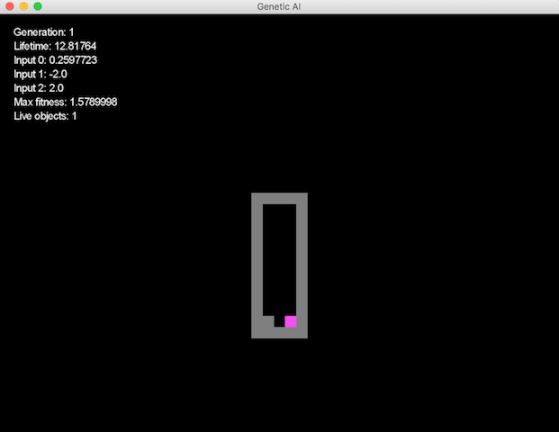

# GA03N 
An example of using a genetic algorithm with a neural network written on java.

## Neural network

Three layers NN is used here.
- Input: 3 neurons
  * A vertical distance between a barrier and a controlled object
  * A horizontal distance between a barrier and a controlled object
  * A distance between left wall and a controlled object
- Hidden: 6 neurons
- Output: 2 neurons
  * Move left
  * Move right